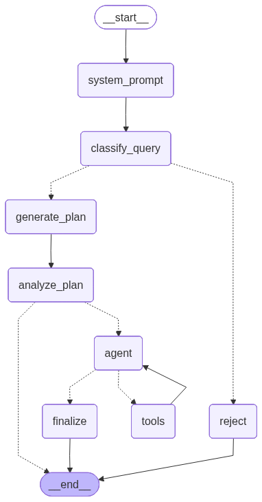

# Purdue AF Agent

LangChain agent with LangGraph for profiling query processing, time extraction, and metadata extraction.

## Agent Architecture



The agent uses a multi-stage workflow:
1. **Classify Query**: Determines if the query is about profiling
2. **Agent Loop**: Analyzes query, calls tools, and reflects on results
   - **Agent**: Decides on actions (tool calls or final answer)
   - **Tools**: Executes tool calls
   - **Think**: Automatically reflects on tool results
3. **Finalize**: Generates final summary with extracted metadata

## Project Structure

```
.
├── app/                    # Source code
│   ├── agent.py           # LangGraph agent with nodes and routing
│   ├── config.py           # Configuration
│   ├── main.py             # FastAPI app
│   ├── prompts.py          # All agent prompts
│   ├── schemas.py          # Pydantic models for state and structured outputs
│   ├── tools.py            # LangChain tools for time operations
│   ├── utils.py            # Utility functions for tool call validation
│   └── requirements.txt    # Python dependencies
├── helm/                   # Kubernetes Helm charts
│   └── purdue-af-agent/
├── docker-compose.yml      # Local development
├── Dockerfile              # Agent container
├── deploy-helm.sh          # Deployment script
├── test.py                # Test client
├── test_utils.py          # Test output formatting utilities
└── agent_diagram.png      # Agent graph visualization
```

## Local Testing

```bash
export OPENAI_API_KEY="your-api-key"
./run_local.sh
```

Or directly:
```bash
docker compose up --build
```

In another terminal:
```bash
python test.py "your query here"
```

## Kubernetes Deployment

```bash
# Deploy agent
./deploy-helm.sh -n cms
```
